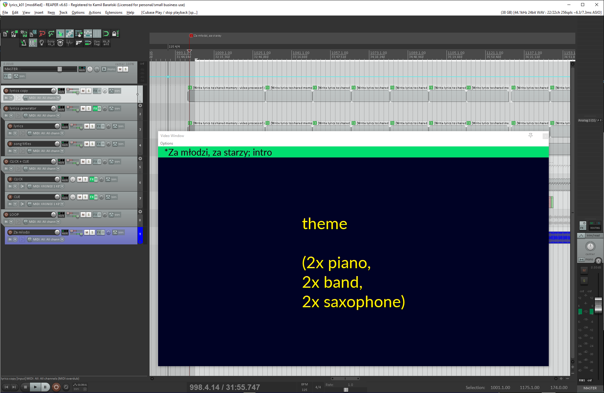

# kbLyrics
## Lyrics generator for Reaper

### INSTALATION
* The easier way is to adjust the provided rpp file to your needs

### WHAT YOU SHOULD KNOW BEFORE ASKING
* The main script that you can adjust to your visual needs is on the **lyrics generator** track.
* The script reads Song title and musical sequence title from media item titles (on **song titles** and **lyrics** tracks).
* The contents of lyrics track must be copied outside (to **lyrics copy** track), otherwise Video Processor can't get lyrics from shared memory (REAPER bug or feature?)
* You may edit lyrics on the media items on **lyrics**/**lyrics copy** track; every musical sequence lyrics is inside the take FX.

